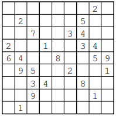
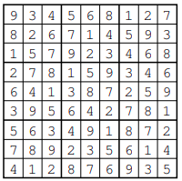

# Sudoku Solver Project 🧩

Welcome to the Sudoku Solver project! This project aims to provide an efficient way to solve Sudoku puzzles using constraint programming and Integer Programming techniques. Whether you're a Sudoku enthusiast or just looking for a challenge, this solver will help you tackle those tricky grids! 😄

## What is Sudoku? 🤔

Sudoku is a classic logic-based number-placement puzzle. The objective is to fill a 9x9 grid with digits from 1 to 9, ensuring that:

- Each row contains every number from 1 to 9 without repetition.
- Each column contains every number from 1 to 9 without repetition.
- Each of the nine 3x3 subgrids (also known as boxes) contains every number from 1 to 9 without repetition.

It sounds simple, right? But sometimes it feels like you need a PhD in puzzle-solving to crack a tough one! 😅

<!-- Images side by side -->
<table>
  <tr>
    <td></td>
    <td></td>
  </tr>
</table>

## Constraints in Our Sudoku Solver 🔍

In this project, we define several constraints that ensure our Sudoku solution adheres to the rules of the game. Here’s a detailed description of each constraint we use:

1. **Cell Constraint**: 
   - **Description**: Each cell in the Sudoku grid must contain exactly one digit from 1 to 9.
   - **Mathematical Representation**: 
     \[
     \sum_{k=1}^{9} x_{ijk} = 1 \quad \forall i, j
     \]
   - **Meaning**: This constraint guarantees that every cell has a unique value, preventing any cell from being empty or holding multiple numbers.

2. **Row Constraint**:
   - **Description**: Each digit from 1 to 9 must appear exactly once in each row.
   - **Mathematical Representation**: 
     \[
     \sum_{j=1}^{9} x_{ijk} = 1 \quad \forall i, k
     \]
   - **Meaning**: This ensures that no number is repeated in any row, keeping the row valid and satisfying Sudoku rules.

3. **Column Constraint**:
   - **Description**: Each digit from 1 to 9 must appear exactly once in each column.
   - **Mathematical Representation**: 
     \[
     \sum_{i=1}^{9} x_{ijk} = 1 \quad \forall j, k
     \]
   - **Meaning**: Just like the row constraint, this ensures that numbers don’t repeat in any column, maintaining the integrity of the Sudoku grid.

4. **3x3 Subgrid Constraint**:
   - **Description**: Each digit from 1 to 9 must appear exactly once in each of the nine 3x3 subgrids.
   - **Mathematical Representation**: 
     \[
     \sum_{i=3r-2}^{3r} \sum_{j=3c-2}^{3c} x_{ijk} = 1 \quad \forall r, c, k
     \]
   - **Meaning**: This ensures that within each 3x3 box, every number appears only once, adding another layer of complexity to the puzzle.

5. **Pre-filled Cells Constraint**:
   - **Description**: If a cell is pre-filled with a digit (i.e., provided as part of the initial puzzle), that digit must remain unchanged in the solution.
   - **Mathematical Representation**: 
     \[
     x_{ijk} = 1 \quad \text{if cell } (i,j) \text{ is pre-filled with digit } k
     \]
   - **Meaning**: This constraint respects the initial setup of the Sudoku puzzle and prevents any alteration to given values.

### Why Did the Sudoku Puzzle Go to Therapy? 
It had too many unresolved issues! 😆
Indeed, solving Sodoku Puzzle is NP-complete problem.

## Conclusion 🎉

This Sudoku Solver project not only provides an algorithm to solve Sudoku puzzles efficiently but also serves as a great way to explore constraint programming. Feel free to contribute or improve the solver, and happy puzzling! 🧠✨

## References 📚

1. Bartlett, A., Chartier, T., Langville, A., & Rankin, T. (2008). An integer programming model for the Sudoku problem. 
